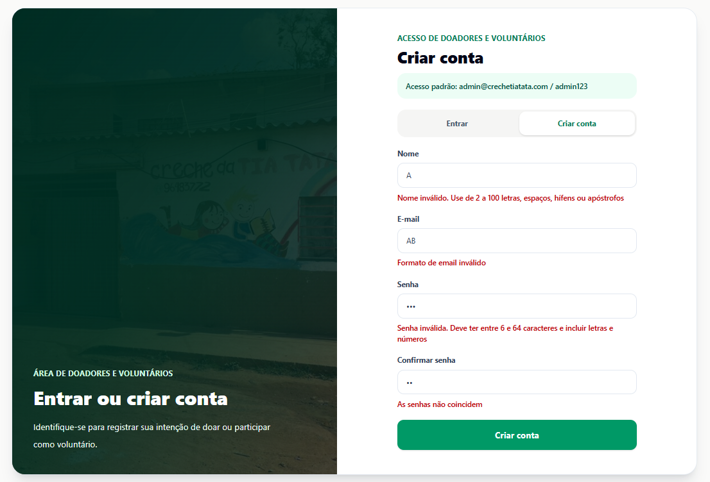
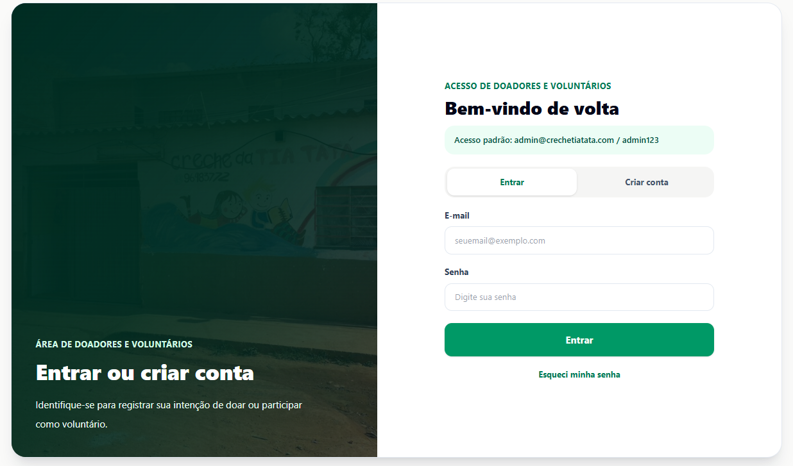
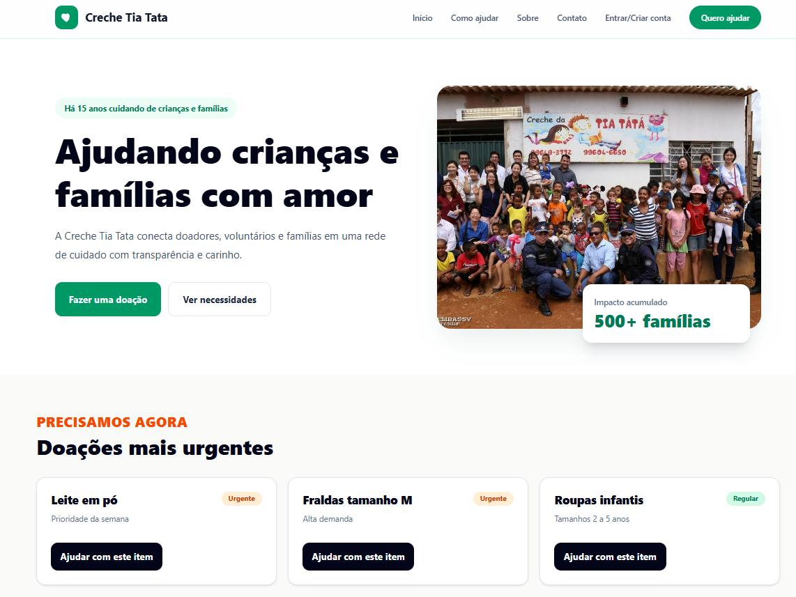
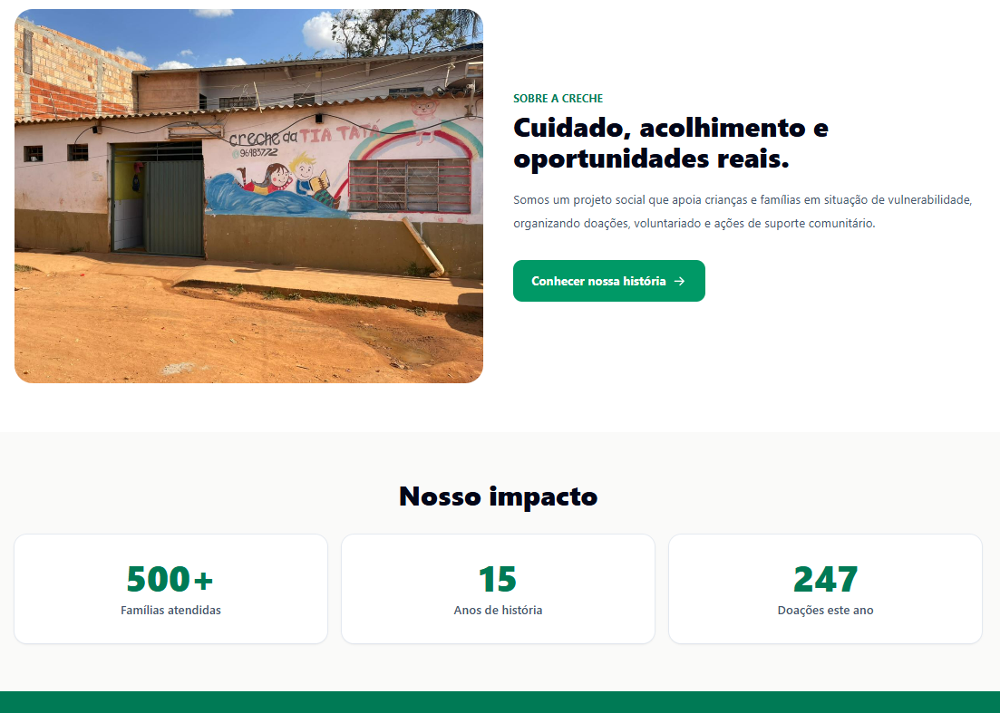
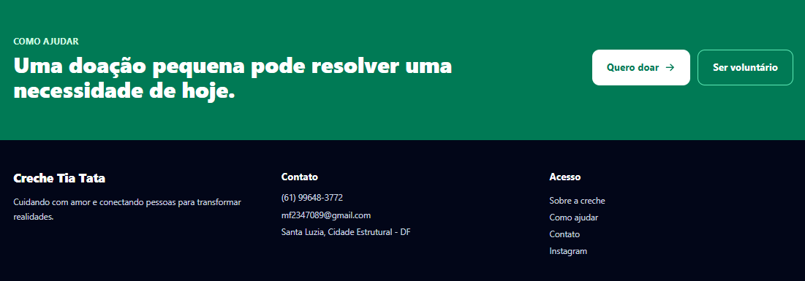
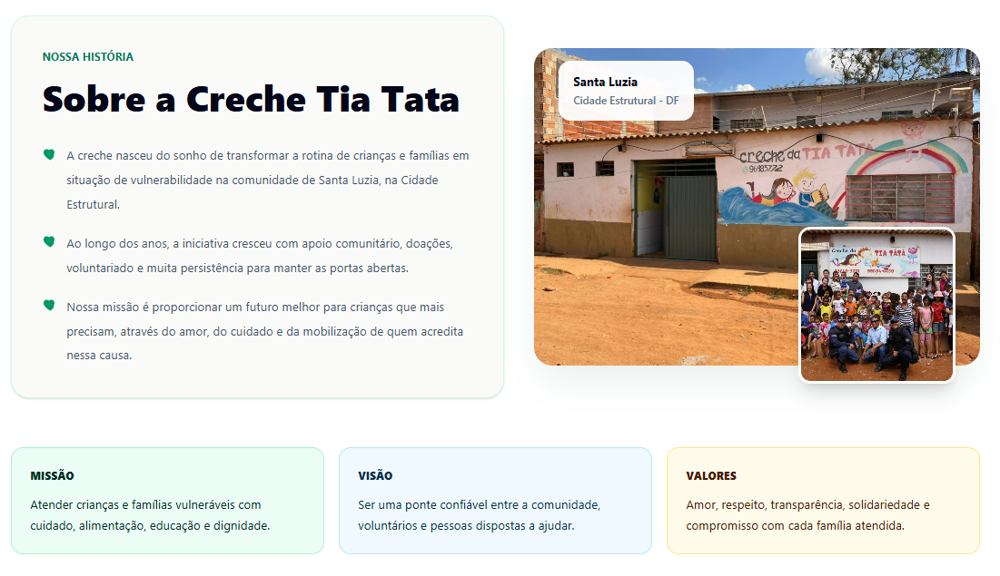
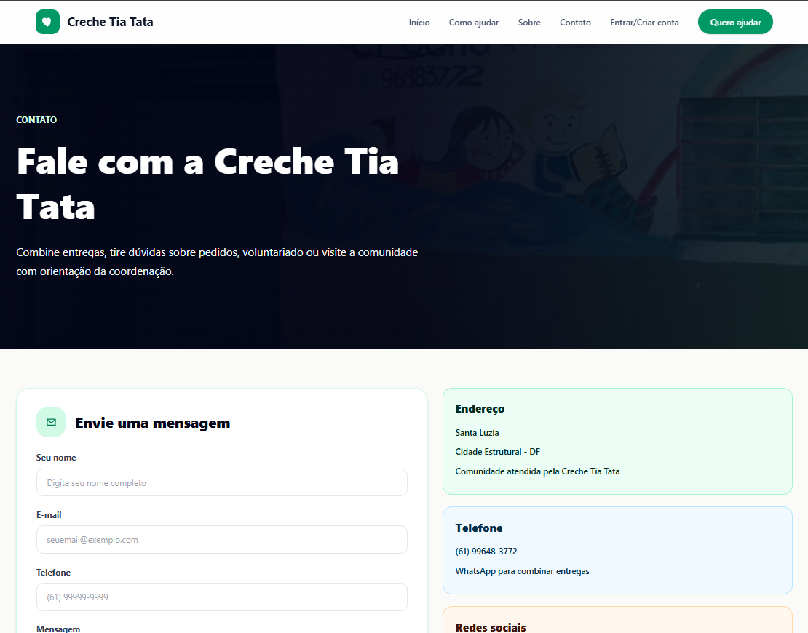
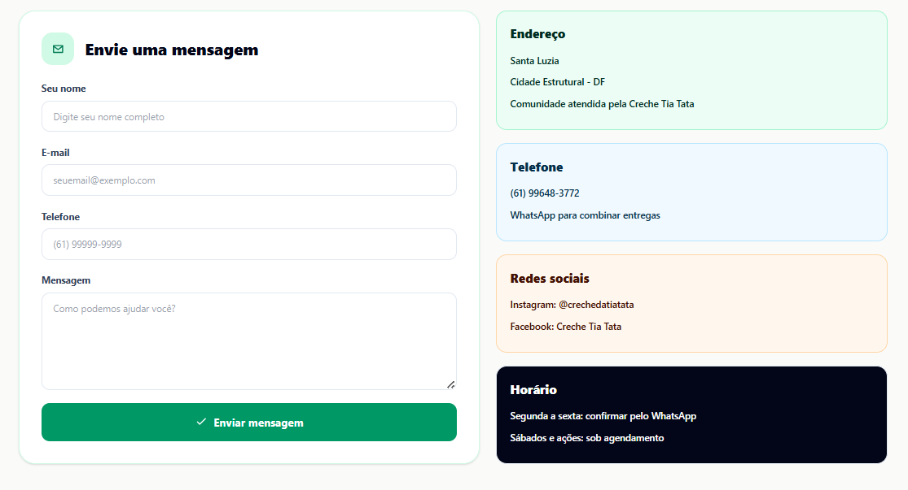
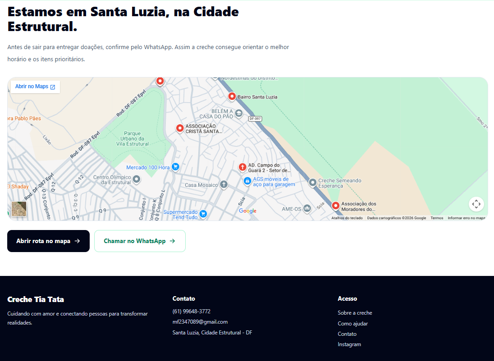

# Andamento do Projeto

## Requisitos funcionais

O sistema possui **27 Requisitos Funcionais** no total. O **MVP contempla 18 RFs** priorizados para as primeiras iterações da fase de Construção.

Situação dos 18 RFs do MVP até 15/06: completos 2, incompletos 10, não feitos 6.

---
Concluídos
* [X] RF-19 - Exibir Informações Institucionais
* [X] RF-09 - Registrar Voluntário
---
Incompletos
* [/] RF-01 - Autenticar Administrador
* [/] RF-12 - Editar Disponibilidade
* [/] RF-11 - Registrar Disponibilidade
* [/] RF-24 - Editar Dados do Voluntário
* [/] RF-23 - Desalocar Voluntário de Tarefa
* [/] RF-22 - Excluir Voluntário
* [/] RF-03 - Listar Doações
* [/] RF-04 - Editar Doação
* [/] RF-06 - Listar Doadores
* [/] RF-10 - Listar Voluntários
---
Não feitos
* [ ] RF-02 - Registrar Doação
* [ ] RF-05 - Registrar Doador
* [ ] RF-07 - Registrar Entrega
* [ ] RF-20 - Publicar Solicitação de Apoio
* [ ] RF-21 - Listar Solicitações de Apoio
* [ ] RF-08 - Listar Entregas

Muitos dos requisitos não estão completos por conta da falta de integração de `Frontend` e `Backend`, no entanto ainda temos 2 semanas para alinhas as partes e terminar o desenvolvimento com deploy

## Comprovações
Futuramento teremos GIFs mostrando o sistema

### RF-9

### RF-19
#### Início

#### Sobre

#### Contato

---

## Cronograma (Fase de construção)
### Iteração 3
* RF-19

Feito: RF-19

### Iteração 4
* RF-09, RF-10, RF-11, RF-12, RF-22, RF-23, RF-24

Feito: RF-09

### Iteração 5
* RF-01, RF-02, RF-03, RF-04, RF-05, RF-06

### Iteração 6
* RF-07, RF-08, RF-20, RF-21

## Versões
|Data|Versão|Descrição|Autor(es)|Revisor(es)|
| :--- | :--- | :--- | :--- | :--- |
| 15/06/2026 | 1.0 | Criação da página com dados até 15/06/2026 | Matheus Pinheiro |  |